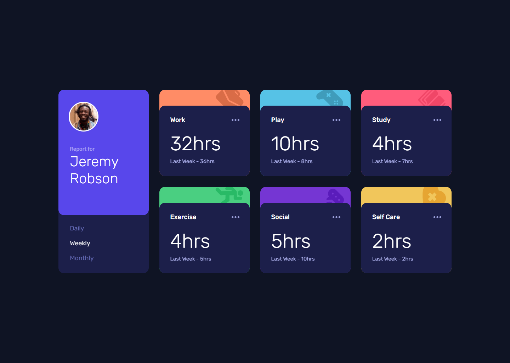
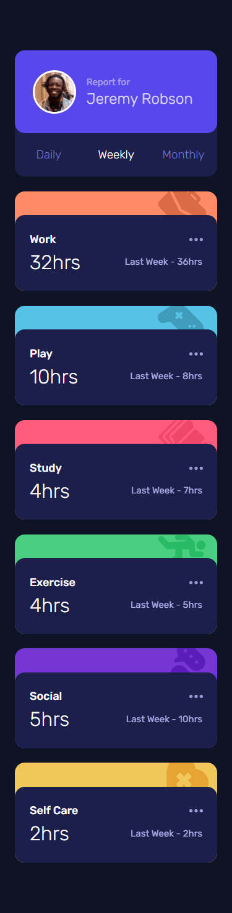

# Frontend Mentor - Time tracking dashboard solution

This is a solution to the [Time tracking dashboard challenge challenge on Frontend Mentor](https://www.frontendmentor.io/challenges/time-tracking-dashboard-UIQ7167Jw).
 
Frontend Mentor challenges help you improve your coding skills by building realistic projects.

## Screenshot
 - Based on original desktop image (1440 x 1024 px).
 - Based on original mobile image (375 x 1469 px).

## The challenge
Users should be able to:
- View the optimal layout depending on their device's screen size.
- See hover states for all interactive elements on the page.
- Switch between viewing Daily, Weekly, and Monthly stats.

## Built with
- HTML5
- CSS3
- JavaScript
- [jQuery](https://jquery.com) - JS library

## Links
- Check out the live [example](https://dimmageiras.github.io/frontend-mentor-time-tracking-dashboard).
- See the [solution](https://www.frontendmentor.io/solutions/time-tracking-dashboard-css-grid-jquery-g-c1U9esx) on Frontend Mentor's website.

## Author
- [@dimmageiras](https://github.com/dimmageiras)
